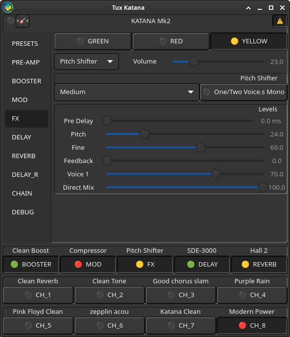

# TuxKatana

> Gtk4 Python3 interface to communicate and configure Boss Katana Mk2 Amp 


## Disclaimer

	⚠️  This app is a work in progress  
	✅ But is working great enough
	
    ⚠️  This app works in "Edit Mode" all the time :
    the reason is : 
    without it the Katana is not sending back other parameters 
    changing with that one you changed  
    ✅ But gives a better experience
    for example, you'll see 'Rate' scale moving with 'Volume' for Flanger
    
    You can switch OFF Edit Mode by clicking on [⚠️]  in the up-right corner
    
    >>> Save your presets first
    
    PS: switching off/on the amp makes it reload its old config
    

## Demo

    (made with bad resolution and low sound level, need a retry ^^')

> [YT - Demo](https://www.youtube.com/watch?v=bfD31DUedUE)

## Screenshots examples




## Missing

* Presets Save/Load (WIP)
* CHAINs (will be hard to do)

## Install
> Under **#Debian trixie**, you **do not** need other special import with pip, than **sounddevice** for now
>
>I'll soon change it to **pulsectl**, so that you'll need nothing more than **Debian main python3 packages**  
>
>Like done with [guit_tunix](https://github.com/s4mdf0o1/guit_tunix) which old version has been integrated here
>
>[Mathieu Lemay](https://github.com/mathieu-lemay) gaves us a **helper with poetry venv for other OS' installation**, but it's not a requirement under Debian based one.

Debian packages:
```bash
$ sudo apt install python3-mido python3-gi gir1.2-gtk-4.0 gir1.2-gstreamer-1.0 python3-bidict python3-ruamel.yaml python3-pulsectl 
```

Easy:
* [poetry](https://python-poetry.org/)

Requirements:
* python >= 3.12  

## Tuner

The USB system brings Katana Pulseaudio sources/sinks :
```bash
$ pactl list short sources | grep KATANA
21	alsa_output.usb-BOSS_KATANA-01.HiFi__Line2__sink.monitor	module-alsa-card.c	s32le 2ch 44100Hz	RUNNING
22	alsa_output.usb-BOSS_KATANA-01.HiFi__Line1__sink.monitor	module-alsa-card.c	s32le 2ch 44100Hz	RUNNING
23	alsa_input.usb-BOSS_KATANA-01.HiFi__Line4__source	module-alsa-card.c	s32le 2ch 44100Hz	RUNNING
24	alsa_input.usb-BOSS_KATANA-01.HiFi__Line3__source	module-alsa-card.c	s32le 2ch 44100Hz	RUNNING
```

The one to be used to tune guitar, is Line4 (Direct Capture), while Line3 is Effects processed one

## [HOW](./HOW.md)

